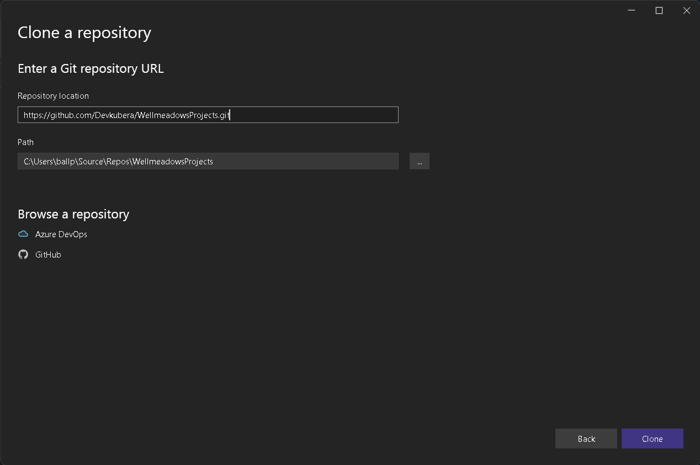
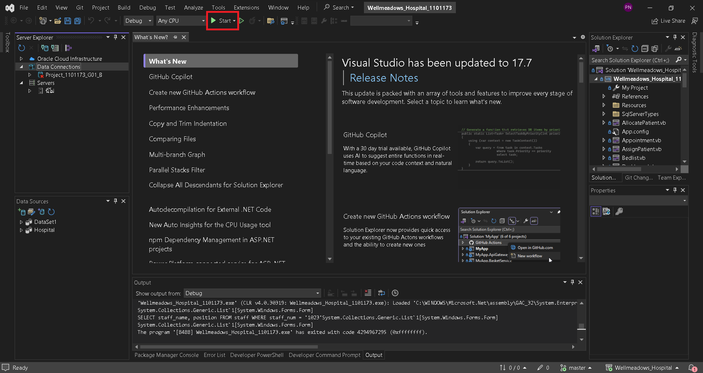
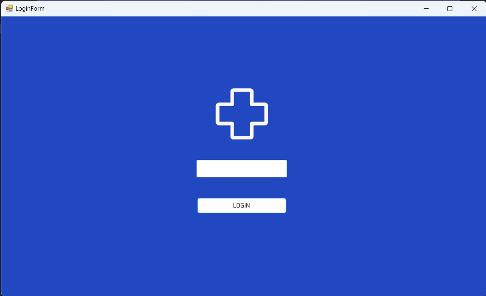

# ระบบฐานข้อมูลโรงพยาบาลผู้สูงอายุ Wellmeadows
 ระบบฐานข้อมูลโรงพยาบาลเป็นระบบที่ช่วยในการบริหารจัดการบริการต่างๆ ไม่ว่าจะเป็นระบบสร้างและแก้ไขข้อมูลเจ้าหน้าที่, ค้นหาเจ้าหน้าที่ตามเงื่อนไขที่กำหนด, สร้างและจัดทำรายงานของเจ้าหน้าที่ในแต่ละวอร์ด, สร้างและจัดการข้อมูลผู้ป่วยที่ถูกส่งตัวมารักษายังโรงพยาบาล, สร้าง จัดการข้อมูลและจัดทำรายงานของผู้ป่วยที่ใช้บริการคลินิกผู้ป่วยนอก, สร้างและจัดการข้อมูลผู้ป่วยที่ถูกส่งไปยังแต่ละวอร์ด, จัดทำรายงานรายละเอียดของผู้ป่วยที่อยู่ในวอร์ดในปัจจุบัน, จัดทำรายงานที่แสดงรายละเอียดผู้ป่วยที่อยู่ในรายชื่อผู้ป่วยรอเตียงในแต่ละ
 วอร์ดและ สร้างและจัดการเวชภัณฑ์ที่ถูกจ่ายให้กับผู้ป่วยแต่ละคน โดยระบบนี้เป็นระบบที่ได้พัฒนาขึ้นเพื่อการศึกษาเพียงเท่านั้น!

## ระบบนี้ดำเนินการโดยเทคโนโลยีต่อไปนี้:
- [Visual Studio 2022](https://visualstudio.microsoft.com/vs/community/)
- [Oracle SQL Developer](https://www.oracle.com/database/sqldeveloper/technologies/download/)
- [Visual Basic.NET](https://visualstudio.microsoft.com/vs/features/net-development/)

## วิธีการติดตั้งและการใช้งานโปรเจคนี้:
1. ดาวน์โหลดโปรเจคนี้ได้จากลิ้งด้านล่างนี้:
```sh
https://github.com/ballalone1234/Wellmeadows_Hospital.git
```
2. ทำการเปิดโปรเจคนี้ด้วยโปรแกรม Visual Studio 2022 และเลือก Clone a repository แล้วกด Next จากนั้นใส่ลิ้งด้านบนลงไปในช่อง Repository location และกด Clone ต่อไป:



3. หลังจาก Clone เสร็จแล้วให้กดปุ่ม Start หากไม่มี ให้กดเปิด Project ที่มี นามสกุลไฟล์เป็น .sin ตรงแถบ Solution Explorer



4. เริ่ม Login และใช้ Program ได้เลย

 
